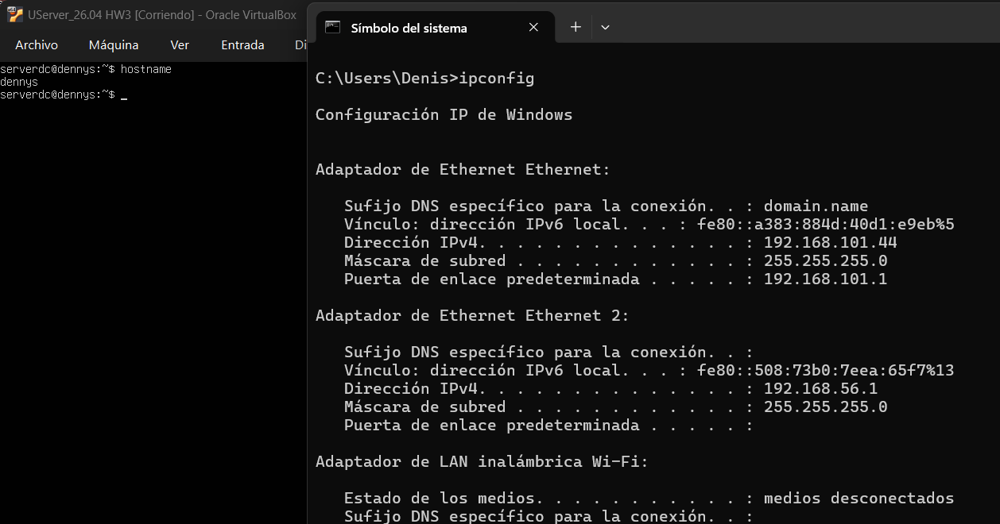
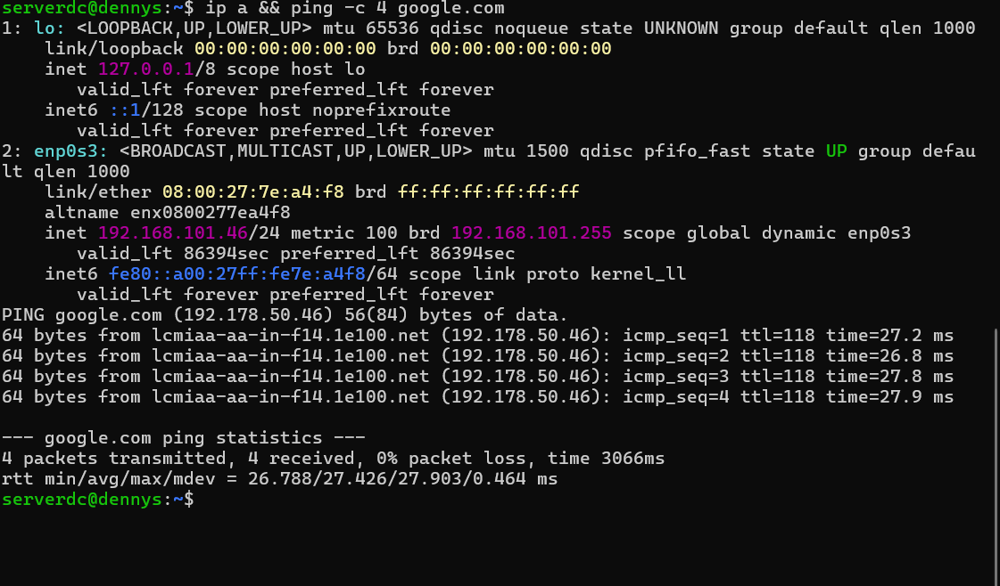
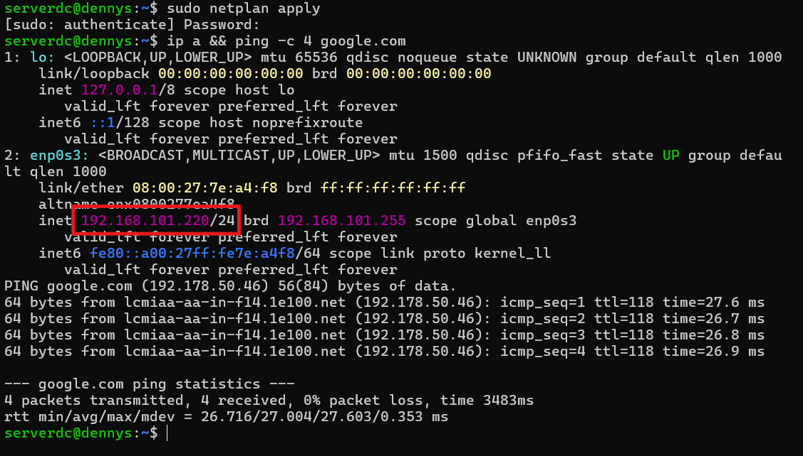
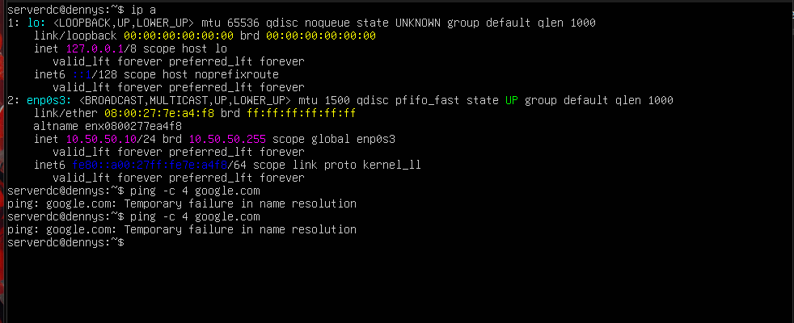

# Virtualizacion
Tareas durante el transcurso del curso

# Tarea 03 - Modos de red VMs

## Subred del Hipervisor y PARTE 1: Configuración de Hostname
- **Subred Host:** 192.168.101.0/24
- **Puerta de Enlace (Gateway):** 192.168.101.1
- **Hostname VM:** dennys

Se muestra la información de red del host físico y la configuración del nombre de host (`dennys`) de la máquina virtual.

---

## PARTE 2: Modo Bridge - DHCP
Configuración de la máquina virtual en modo puente (Bridge) obteniendo su dirección IP automáticamente mediante DHCP y verificando conectividad hacia Internet con 4 pings a Google.com.

---

## PARTE 3: Modo Bridge - IP Manual (Misma Subred)
Configuración de IP estática manual dentro del mismo segmento de red (`192.168.101.220/24`) con puerta de enlace `192.168.101.1`, manteniendo la salida funcional hacia Internet.

---

## PARTE 4: Modo Bridge - IP Manual (Fuera de Subred)
Configuración de IP estática manual en un segmento no perteneciente a la red local (`10.50.50.10/24`), evidenciando la falta de comunicación y salida a Internet (resultado esperado).

