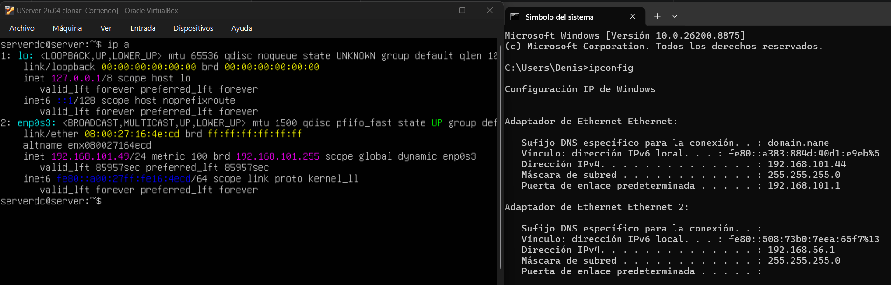
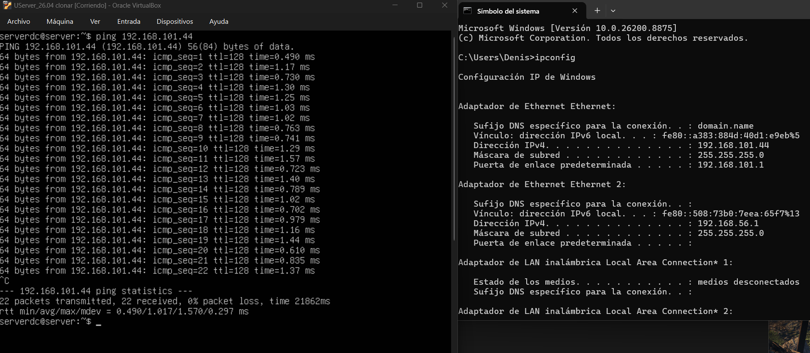

# Virtualizacion
Tareas durante el transcurso del curso

# Tarea 01 - Conexión Host - Máquina Virtual

## Configuración de Red
- **IP Host Local:** `192.168.101.44`
- **IP Servidor Virtual:** `192.168.101.49/24`

## Capturas de Evidencia

## Prueba de Conectividad (Ping)
