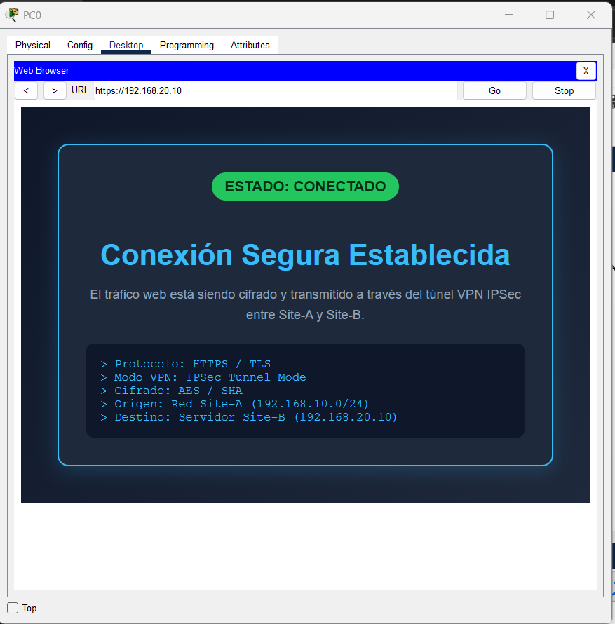
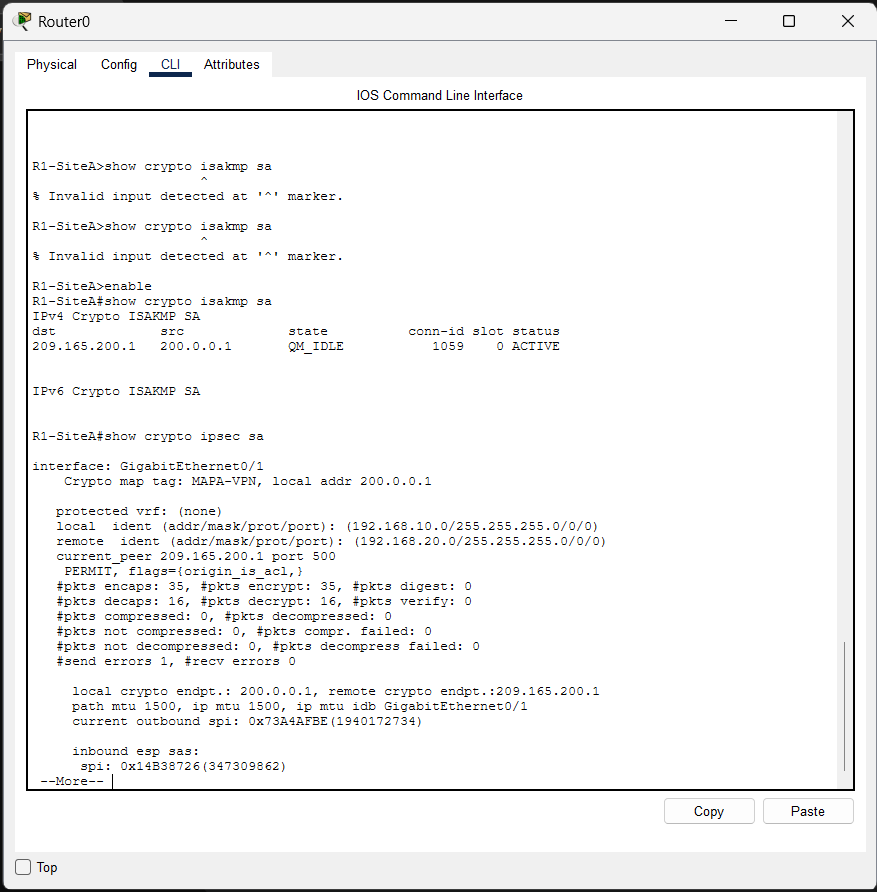
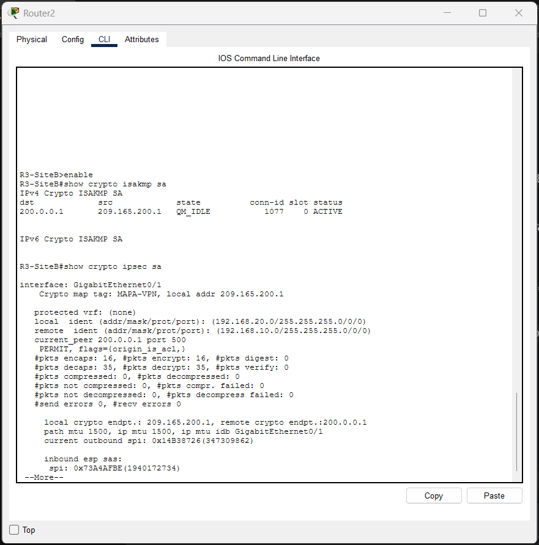
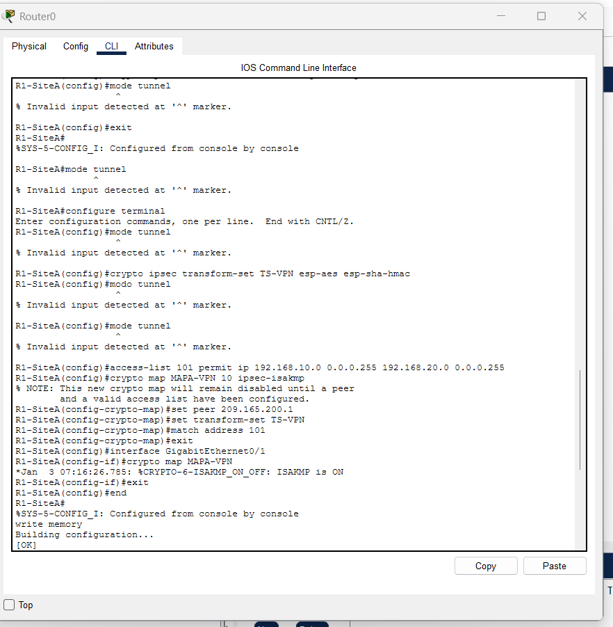
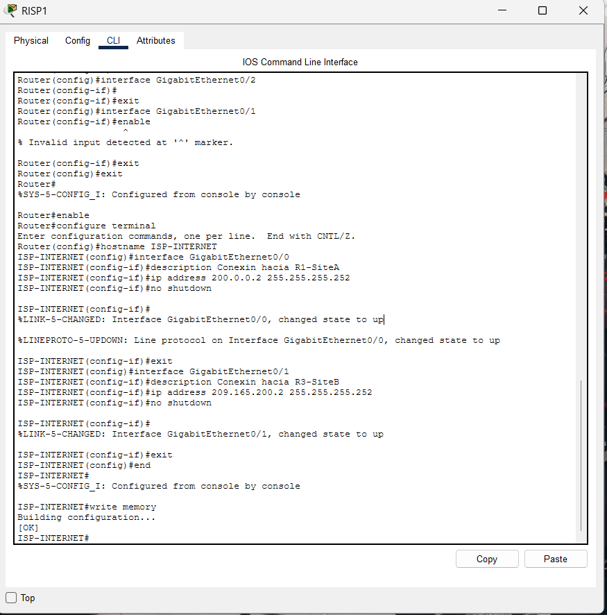
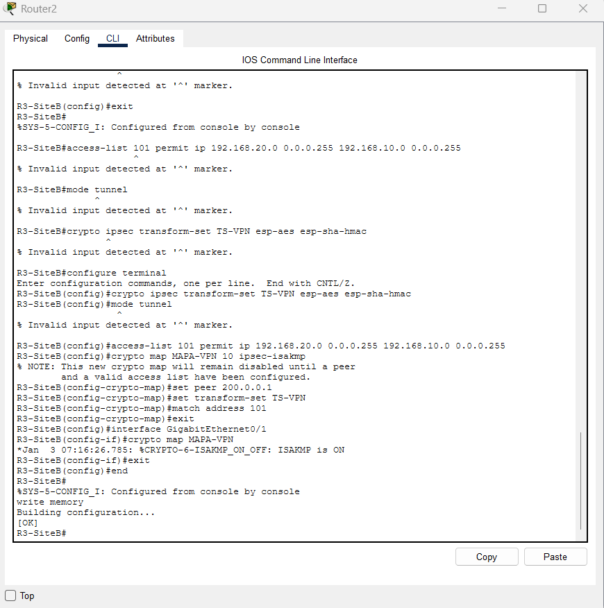

# Virtualizacion
Tareas durante el transcurso del curso

# Tarea 04 - Conexión IPSec

## Descripción
Implementación de un túnel VPN IPSec en modo túnel entre Site-A y Site-B a través de un router ISP, permitiendo tráfico HTTPS seguro.

## Evidencia de Conexión HTTPS

## Verificación del Túnel IPSec
* **Estado ISAKMP:** `QM_IDLE`
* **Encapsulación / Desencapsulación:** Tráfico cifrado exitoso entre `192.168.10.0/24` y `192.168.20.0/24`.

### Comprobación R1 (Site-A)

### Comprobación R3 (Site-B)

## Configuraciones de Routers

### R1 - Site-A (Router0)

### ISP - Internet (RISP1)

### R3 - Site-B (Router2)
