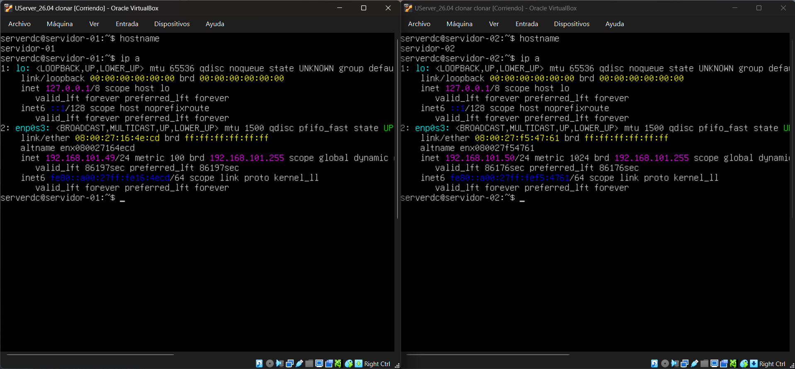
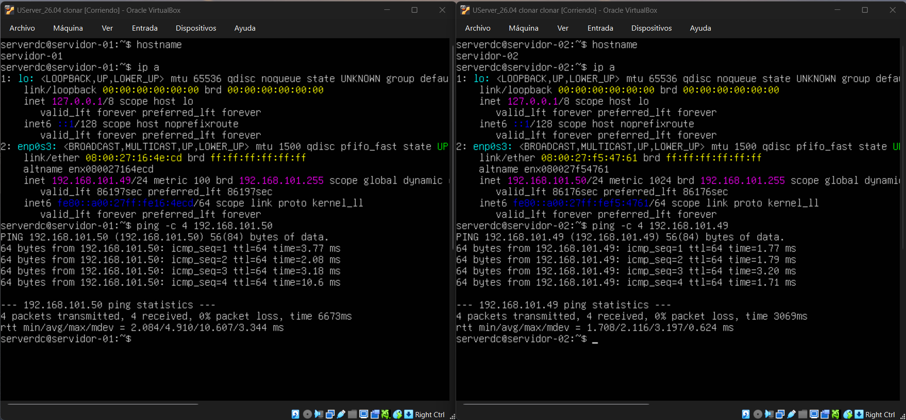

# Virtualizacion - Dennys Carreto
# Tarea 02 - Conexión Host Virtual a Host Virtual

## Configuración de los Servidores Virtuales

| Servidor | Hostname | Dirección IP | Adaptador de Red |
| :--- | :--- | :--- | :--- |
| **Servidor 1** | `servidor-01` | `192.168.101.49` | Adaptador Puente (Bridged) |
| **Servidor 2** | `servidor-02` | `192.168.101.50` | Adaptador Puente (Bridged) |

---

## Capturas de Evidencia

### 1. Configuración de IP y Hostname de ambos Hosts Virtuales

### 2. Prueba de Conectividad (Ping de VM1 a VM2)
