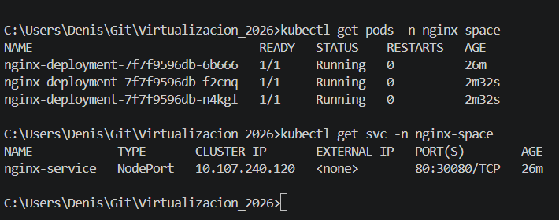
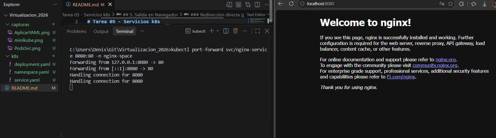
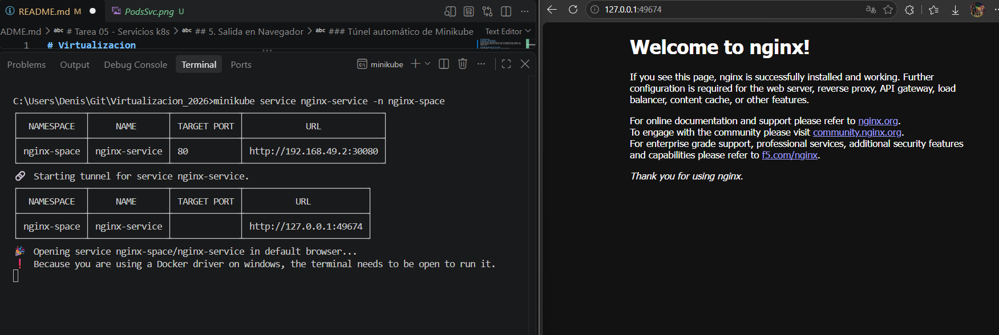

# Virtualizacion
# Tarea 05 - Servicios k8s
Configuración y despliegue de servicios en Kubernetes para exponer una aplicación Nginx hacia el entorno local.

## EJECUCION 
1. Aplicar los .yaml
```bash
kubectl apply -f k8s/namespace.yaml
kubectl apply -f k8s/deployment.yaml
kubectl apply -f k8s/service.yaml
```
2. Servicios
Opción A: Redirección directa (`port-forward`)
```bash
kubectl port-forward svc/nginx-service 8080:80 -n nginx-space
```
* Acceder a: http://localhost:8080

Opción B: Túnel automático de Minikube
```bash
minikube service nginx-service -n nginx-space
```


## Estado de Recursos en el Clúster SVC Y PODS
* ### **Salida: `kubectl get pods -n nginx-space`**
* ### **Salida: `kubectl get svc -n nginx-space`**




## Salida en Navegador

### **Redirección directa (`port-forward`)**


### **Túnel automático de Minikube**



* ## EXTRAS:Archivos de Configuración (IaC)

Toda la infraestructura se encuentra declarada dentro de la carpeta `k8s/`:

* ### **Definición del Namespace (`k8s/namespace.yaml`)**
* ### **Definición del Deployment (`k8s/deployment.yaml`)**
* ### **Definición del Servicio (`k8s/service.yaml`)**
