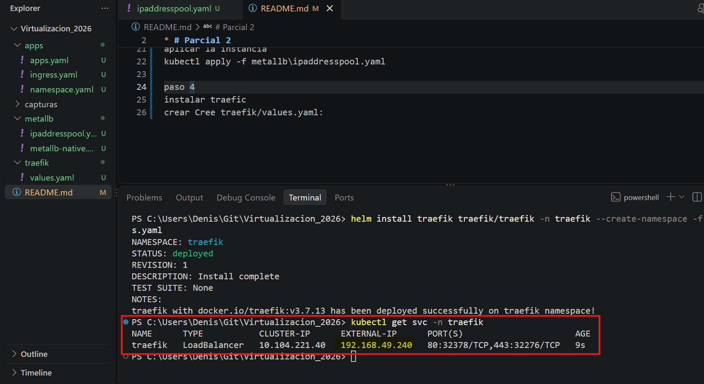
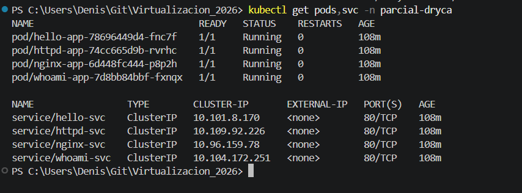
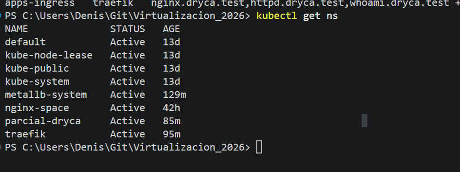
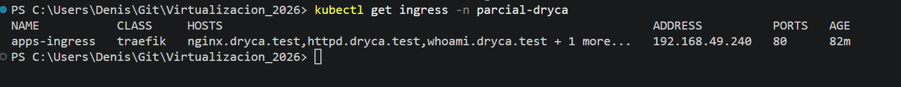
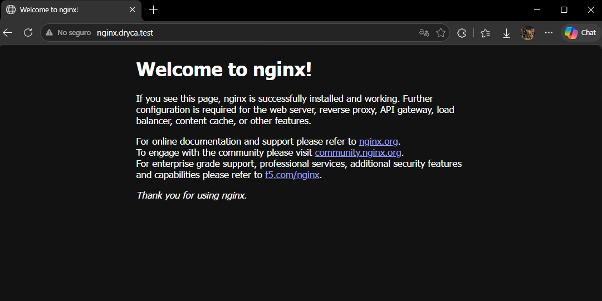
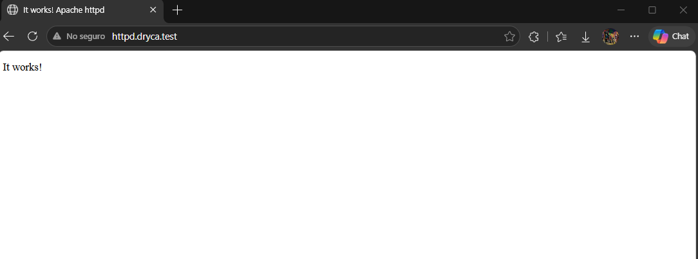
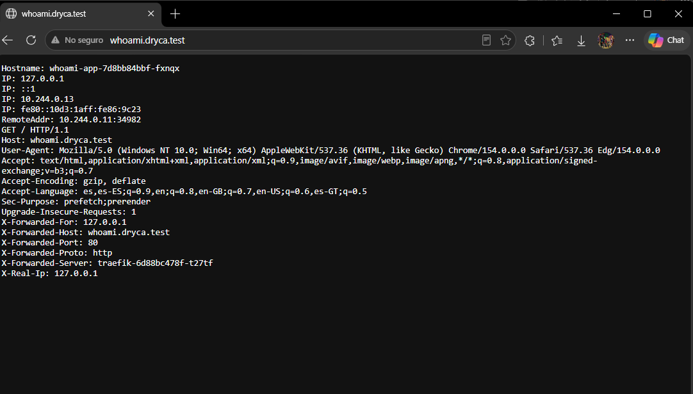
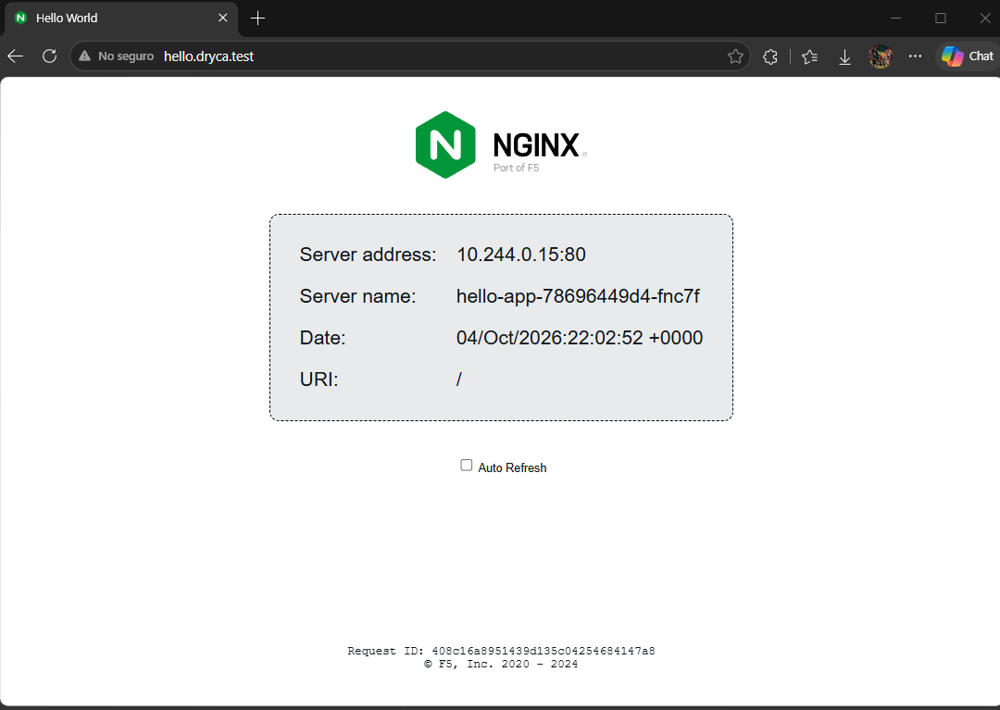

# Virtualizacion
# Assessment 02 - Kubernetes, Traefik y MetalLB

Documentación técnica y pasos de configuración paso a paso para el aprovisionamiento de clúster local, balanceador de carga bare-metal (MetalLB), Ingress Controller (Traefik), despliegue de microservicios e infraestructura como código (IaC).

---
## 1. Requisitos Previos
- **Sistema Operativo:** Windows con PowerShell
- **Virtualización:** Docker Desktop activo
- **Herramientas de CLI:**
  - `minikube`
  - `kubectl`
  - `helm` (v3+)
  - `git`

Estructura del Proyecto (IaC)
Toda la infraestructura, servicios y cargas de trabajo están declarados como código (IaC) en la siguiente estructura:
```text
├── apps/
│   ├── apps.yaml                   # IaC: Deployments y Services (nginx, httpd, whoami, hello)
│   ├── ingress.yaml                # IaC: Reglas de enrutamiento por nombres de dominio
│   └── namespace.yaml              # IaC: Creación declarativa del namespace parcial-dryca
├── capturas/                       # Evidencias visuales de verificación y acceso web
├── metallb/                        # IaC: Configuración de MetalLB
│   ├── ipaddresspool.yaml          # IaC: Asignación del pool de direcciones IP
│   └── metallb-native.yaml         # IaC: Manifiesto base del operador
├── traefik/                        # IaC: Configuración Helm para Traefik
│   └── values.yaml                 # IaC: Valores de Traefik (Service LoadBalancer)
└── README.md
```

---

## 2. Inicialización del Clúster
Inicio del clúster de Kubernetes en Minikube utilizando el driver de Docker:

```powershell
minikube start --driver=docker
```

Verificación del estado del nodo:
```powershell
kubectl get nodes
```


## 3. Instalación y Configuración de MetalLB
MetalLB provee una implementación de balanceador de carga de red para clústeres bare-metal o Minikube.

1. **Despliegue del operador MetalLB (namespace `metallb-system`):**
   ```powershell
   kubectl apply -f metallb/metallb-native.yaml
   ```

2. **Esperar a que los pods de `controller` y `speaker` estén completamente operativos:**
   ```powershell
   kubectl wait --namespace metallb-system --for=condition=ready pod --all --timeout=120s
   ```

3. **Aplicar el AddressPool y L2Advertisement:**
   Configura el rango estático reservado (`192.168.49.240/32`):
   ```powershell
   kubectl apply -f metallb/ipaddresspool.yaml
   ```

---

## 4. Instalación de Traefik (Ingress Controller)
Despliegue de Traefik mediante Helm utilizando `values.yaml` personalizado para asignar el servicio como `LoadBalancer` con la IP fija de MetalLB (`192.168.49.240`).

1. **Añadir y actualizar el repositorio de Traefik:**
   ```powershell
   helm repo add traefik https://traefik.github.io/charts
   helm repo update
   ```

2. **Instalar Traefik en el namespace dedicado:**
   ```powershell
   helm install traefik traefik/traefik -n traefik --create-namespace -f traefik/values.yaml
   ```

3. **Verificar asignación de IP Externa:**
   ```powershell
   kubectl get svc -n traefik
   ```



---

## 5. Despliegue de Aplicaciones y Servicios (IaC)
Despliegue de los 4 servicios internos (`nginx`, `httpd`, `whoami`, `hello`) bajo el namespace de trabajo.

1. **Creación del namespace:**
   ```powershell
   kubectl create namespace parcial-dryca
   ```

2. **Aplicar manifiestos de Deployments y Services (ClusterIP):**
   ```powershell
   kubectl apply -f apps/apps.yaml -n parcial-dryca
   ```

3. **Verificar pods y servicios activos:**
   ```powershell
   kubectl get pods,svc -n parcial-dryca
   ```

* Pods y servicios activos

* NAMESPACE


---

## 6. Configuración de Reglas Ingress
Enrutamiento basado en nombres de dominio (FQDN) que delega el tráfico HTTP desde Traefik hacia los servicios internos correspondientes:

```powershell
kubectl apply -f apps/ingress.yaml -n parcial-dryca
```

Verificación del Ingress:
```powershell
kubectl get ingress -n parcial-dryca
```

* Ingress resultado


---

## 7. Configuración de DNS Local y Enrutamiento

En entornos Windows con Minikube sobre el driver Docker, la subred interna del contenedor Minikube no es directamente enrutable desde el host. Para resolver los nombres de dominio y permitir el acceso web:

### A. Mapeo en archivo `hosts`
Abrir **Notepad / Bloc de notas como Administrador** y editar el archivo:
`C:\Windows\System32\drivers\etc\hosts`

Agregar las siguientes entradas DNS locales:
```texts
127.0.0.1 nginx.dryca.test
127.0.0.1 httpd.dryca.test
127.0.0.1 whoami.dryca.test
127.0.0.1 hello.dryca.test
```

### B. Puente de Tráfico (Port-Forward)
Para exponer el servicio LoadBalancer hacia el puerto 80 del host local, ejecutar en una terminal (mantener abierta durante las pruebas):
```powershell
kubectl port-forward -n traefik svc/traefik 80:80
```

*(Alternativa de verificación interna directa hacia la IP de MetalLB desde el nodo Minikube):*
```powershell
minikube ssh -- curl -s -H "Host: whoami.dryca.test" http://192.168.49.240
```

---

## 8. Evidencias de Acceso Web por Dominio

Las siguientes capturas certifican la resolución de nombres DNS y el enrutamiento HTTP correcto de Traefik hacia cada aplicación:

### Servicio 1: Nginx (`http://nginx.dryca.test`)


### Servicio 2: Apache HTTPD (`http://httpd.dryca.test`)


### Servicio 3: Whoami (`http://whoami.dryca.test`)


### Servicio 4: Hello (`http://hello.dryca.test`)
